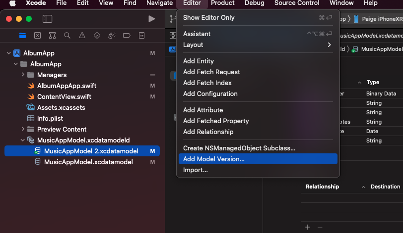

# Migrations

### Documentation

- Lightweight (automatic) migration
- Heavyweight (manual) migration

### Agenda

- Fully automatic lightweight migration
- Lightweight migration with a model map

### Lightweight Migration

**1) Add Model Version**

ex)

.png)

- MusicAppModel.xcdatamodel
- MusicAppModel 2.xcdatamodel

**2) Set Model Version**

- Current ⇒ MusicAppModel 2

ex)

.png)

### Migration with mapping file

[https://www.udemy.com/course/core-data-in-ios/learn/lecture/25823714#overview](https://www.udemy.com/course/core-data-in-ios/learn/lecture/25823714#overview)
